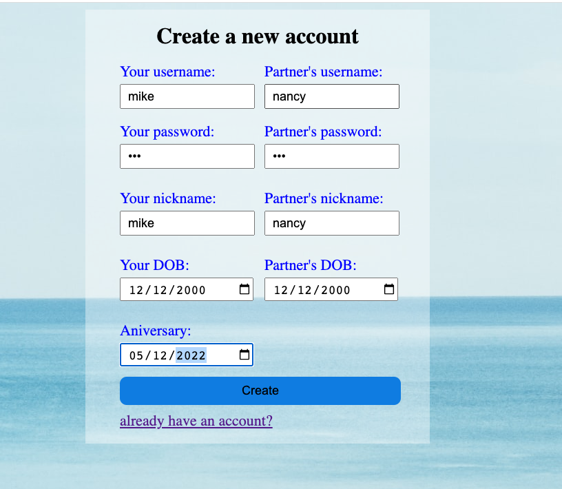
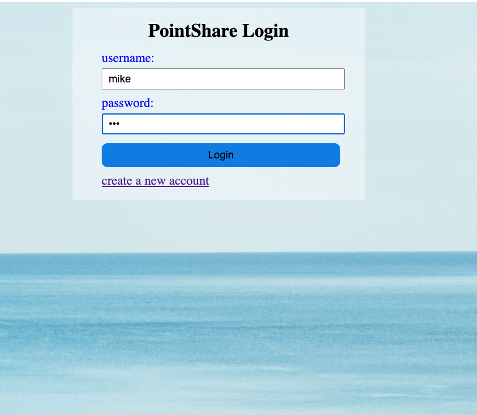
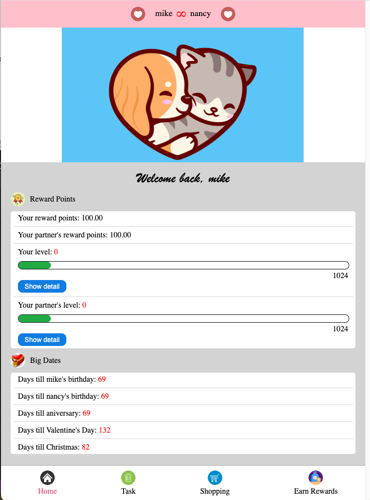
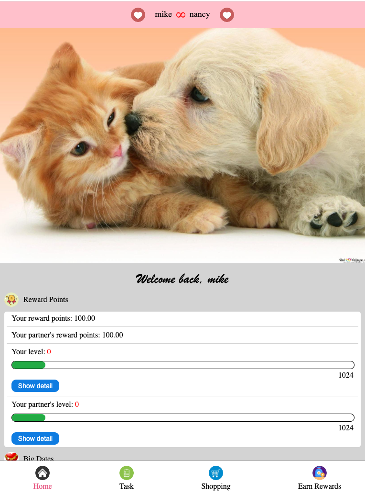
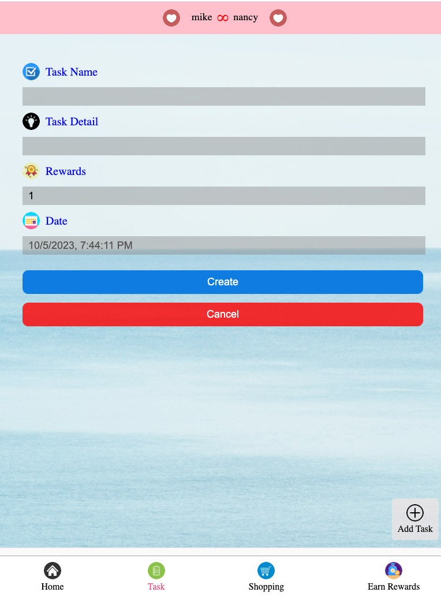
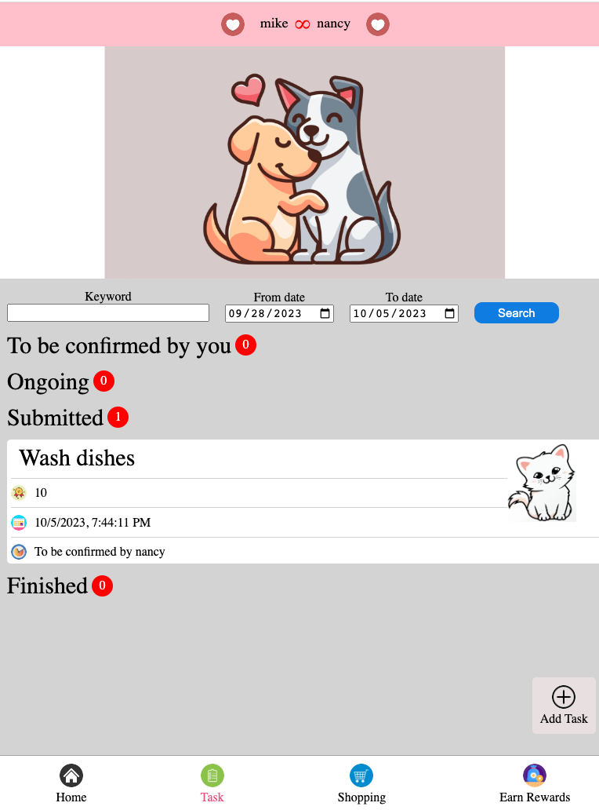
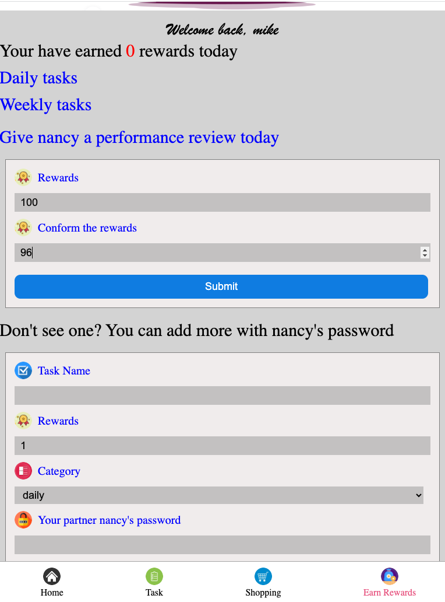
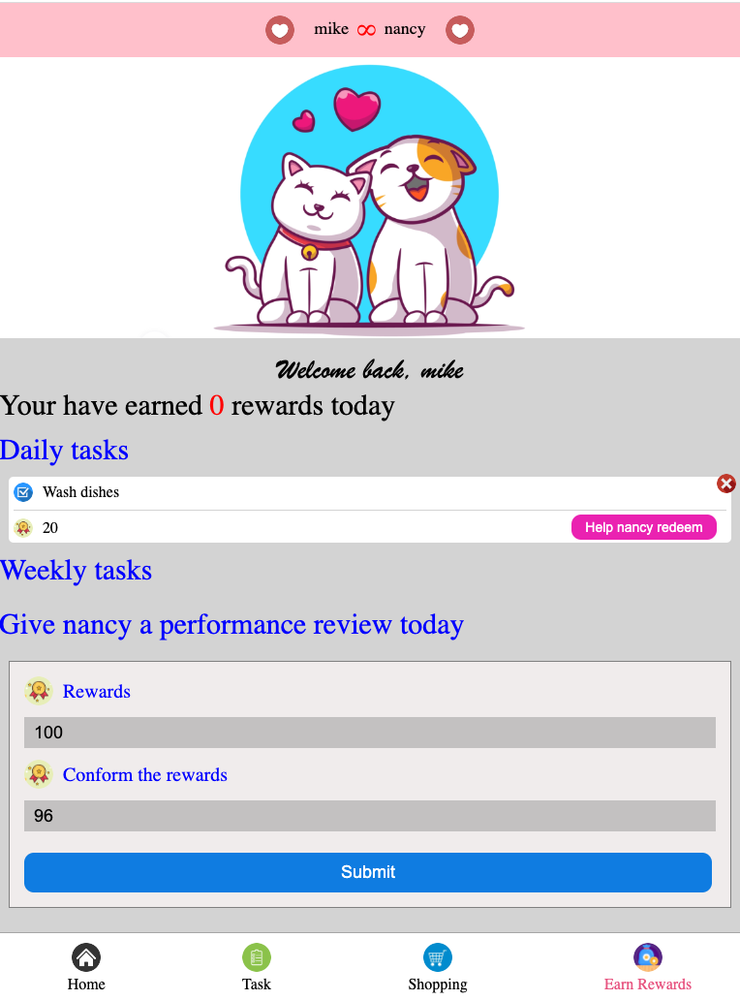
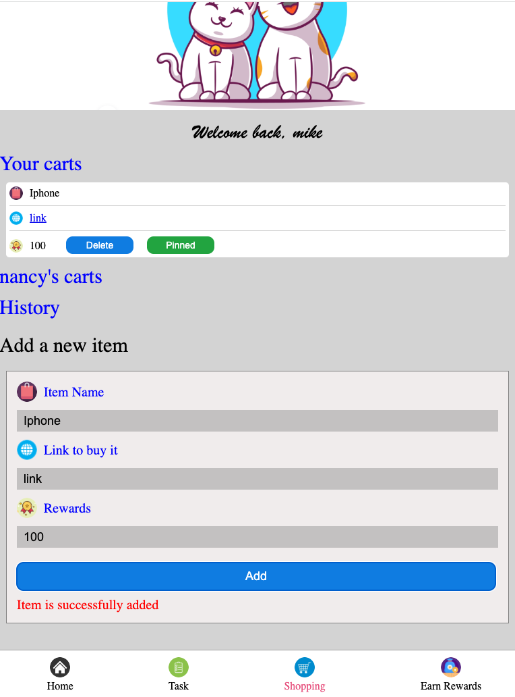

# Share Point App
An application to bring you and your partner relationship one step further. 

- To run the frontend.

```
> cd frontend
> npm install .
> npm start
```

- To run the backend, you first need to modify the `URI` param in `backend/.env`. The value of it is the MongoDB connection string. To create a new cluster to get the connection string, you can follow this [tutorial](https://www.mongodb.com/basics/clusters/mongodb-cluster-setup).

```
> cd backend
> npm install .
> npm start
```


## Registration



## Login



## Home page




## You can use your own image



## Add a task for your partner to finish.





## Reward your parther based on his performance.



## Add daily/weekly tasks.



## Use your reward to shop around

